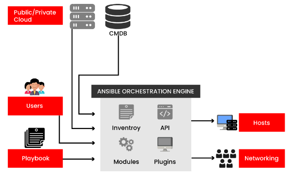

1. What is Ansible?
        Ansible is developed in Python. It is a software tool. It is useful while deploying any application using ssh without any downtime. Using this tool one can manage and configure software applications very easily.

2. Ansible Playbooks vs Roles
       * Roles:
           1. Roles are reusable subsets of a play.
           2. A set of tasks for accomplishing a certain role.	
           3. Example: common, webservers.	
       * Playbooks:
           1. Playbooks contain Plays.
           2. Mapps among hosts and roles.
           3. Example: site.yml, fooservers.yml, webservers.yml.
   
3. What are the advantages of using Ansible?
       * The main three advantages of using this tool are,i.e. Ansible

           1. Agentless
           2. Very low overhead
           3. Good performance.

4. Compare Ansible VS Puppet
       * Ansible:
           1. Simplest Technology 
           2. Written in YAML language	
           3. Automated workflow for Continuous Delivery	
           4. Agent-less install and deploy	
           5. No support for Windows	
           6. GUI -work under progress	
           7. CLI accepts commands in almost any language	
       * puppet:
           1. Complex Technology
           2. Written in Ruby language 
           3. Visualization and reporting
           4. Easy install
           5. Support for all major OS’s
           6. Good GUI
           7. Must learn the Puppet DSL
5.  How does Ansible Works?
       * There are many similar automation tools available like Puppet,   Capistrano, Chef, Salt, Space Walk, etc, but Ansible categorizes into two types of servers: controlling machines and nodes.
        
       * The controlling machine, where Ansible is installed and Nodes are        managed by this controlling machine over SSH. The location of nodes is specified by the controlling machine through its inventory.
     
       * The controlling machine (Ansible) deploys modules to nodes using SSH protocol and these modules are stored temporarily on remote nodes and communicate with the Ansible machine through a JSON connection over the standard output.
 
       * Ansible is agent-less, which means no need for any agent installation on remote nodes, so it means there are no background daemons or programs executing for Ansible when it’s not managing any nodes.
        
       * Ansible can handle 100’s nodes from a single system over an SSH connection and the entire operation can be handled and executed by one single command ‘ansible’. But, in some cases, where you are required to execute multiple commands for a deployment, here we can build playbooks.
        
       * Playbooks are a bunch of commands which can perform multiple tasks and each playbook are in YAML file format.
        
6. What’s the Use of Ansible?
       * Ansible can be used in IT Infrastructure to manage and deploy software applications to remote nodes. For example, let’s say you need to deploy a single software or multiple software to 100’s of nodes by a single command, here ansible comes into the picture, with the help of Ansible you can deploy as many applications to many nodes with one single command, but you must have a little programming knowledge for understanding the ansible scripts.
        
       * We’ve compiled a series on Ansible, title ‘Preparation for the Deployment of your IT Infrastructure with Ansible IT Automation Tool‘, through parts 1-4 and covers the following topics. 

7. Explain Ansible architecture?
       Ansible automation engine is the main component of Ansible, which interacts directly with the configuration management database, cloud services, and various users who write playbooks to execute it.

       * The below figure depicts the Ansible architecture:
         
       * The following are the components of the Ansible Automation engine:

         * Modules: Ansible works effectively by connecting nodes and pushing out scripts called "Ansible modules". It helps to manage packages, system resources, files, libraries, etc.
         * Inventories: These are the lists of nodes or hosts containing their databases, servers, IP addresses, etc. 
         * APIs: These are used for commuting public or private cloud services.
         * Plugins: Plugins augment Ansible's core functionality. Also offers extensions and options for the core features of Ansible - transforming data, connecting to inventory, logging output, and more. 
         * Playbooks: Describes the tasks that need to be executed. They are simple code files written in YAML format and can be used to declare configurations, automating tasks, etc.
         * Hosts: Hosts are node systems that are automated by Ansible on any machine like Linux, RedHat, Windows, etc.
         * Networking: Ansible can be used to automate multiple networks and services. It uses a secure and simple automation framework for IT operations and development.
         * Cloud: A system of remote servers that allows you to store, manage, and process data, rather than a local server.
         * CMDB: It is a type of repository which acts as a data warehouse for IT installations.

8. What is CI/CD? And how Ansible is related to it?
       * CI/CD is one of the best software development practices to implement and develop code effectively. CI stands for Continuous Integration, and CD stands for continuous delivery. Continuous Integration is a collection of practices that drive developers to implement and check in code to version control repositories. Continuous delivery picks up where continuous Integration ends. This process builds software in such a way that software will be released into production at any given time.

       * Ansible is an excellent tool for CI/CD processes, which provides a stable infrastructure to a provision target environment and then deploys the application to it.

9. Can you create reusable content with Ansible?
        Yes, Ansible has the concept of roles that helps to create reusable content. To create a role, you need to follow Ansible's conventions of structuring directories and naming files.

10. Is Ansible a Configuration management tool?
        Configuration management is the practice to handle updates and manage the consistency of a product's performance over a particular period of time. Ansible is an open-source IT Configuration Management tool, which automates a wide variety of challenges in complex multi-tier IT application environments.
         
11. What are the differences between the variable name and environment variables?
       * Variable Names:	
            1. By adding strings, we can build variable names	
            2. Supports adding more strings	
            3. Use the IPV4 address for variable names. 	
       * Environment Variables:
            1. By accessing existing variables, we can access environment variables
            2. The advanced playbooks section sets the environment variables.
            3. Use {{ansible_env.SOME_VARIABLE}} for remote environment variables

12. How to create an empty file with Ansible?
        To create an empty file, Ansible uses a file module. For this, we need to set up two parameters.

            * Path - This place represents the location where the file gets created, either the relative or an absolute path. Also, the name of the file includes here.
            * State - For creating a new file, this parameter should be set to touch.

13. How will you set the environment variable or any path for a task or entire playbook?
        To set the environment variables, we use the environment keyword. We'll use it at the task or other levels in the play:
        `environment:
           PATH: "{{ ansible_env.PATH }}:/thingy/bin"
           SOME: value`

14. How would you describe yourself in terms of what you do and how you’d like to be remembered?
        Obviously, I’d like to be remembered as a master of prose who forever changed the face of literature as we know it, but I’m going to have to settle for being remembered as a science fiction writer (and, more and more, critic) who wrote the occasional funny line and picked up a few awards.

15. Why are you attracted to science and science fiction?
       * Early imprinting, maybe, for science fiction. When I was quite small a family friend let me read his 1950s run of ‘Galaxy’ magazine. My favorite aunt pressed John Wyndham’s ‘The Day of the Triffids’ on me; a more terrifying great-aunt gave me G.K. Chesterton’s fantastic novels; and so on.

       * The incurable addiction had begun. Meanwhile, science classes just seemed to be the part of a school that made the most sense, and I fell in love with Pelican pop-maths titles – especially Kasner’s and Newman’s ‘Mathematics and the Imagination’ and all those books of Martin Gardner’s ‘Scientific American’ columns.

16. Tell us about your software company and what sort of software it produced(s).
       * This goes back to the 1980s and the Apricot home computers, the early, pretty, and non-PC-compatible ones. My pal Chris Priest and I both used them for word processing, and he persuaded me to put together a disk of utilities to improve the bundled ‘SuperWriter’ w/p, mostly written in Borland Turbo Pascal 3 and later 4: two-column printing, automated book index preparation, cleaning the crap out of the spellcheck dictionary, patching SuperWriter to produce dates in UK format, and so on.

       * Then I redid the indexing software (‘AnsibleIndex’) in CP/M for the Amstrad PCW and its Locoscript word processors. When the Apricot market collapsed, I wrote an Apricot emulator in assembler so that people could keep using their horrible but familiar old software on a PC. Eventually, in a fit of nostalgia, I collected all my columns for ‘Apricot File’ and various Amstrad PCW magazines as books unoriginally titled ‘The Apricot Files’ and ‘The Limbo Files’. (That’s probably enough self-promotion, but there’s lots more at https://ansible.uk/.)

17. Describe your newsletter Ansible and who it’s aimed at.
It appears monthly and has been called the ‘Private Eye’ of science fiction, but isn’t as cruel and doesn’t (I hope) recycle old jokes quite as relentlessly. Though I feel a certain duty to list some bread-and-butter material like conventions, award winners, and deaths in the field, ‘Ansible’ skips the most boring SF news – the long lists of books acquired, books published, book sales figures, major new remainders – in favor of quirkier items and poking fun at SF notables. The most popular departments quote terrible lines from published SF/fantasy and bizarre things said about SF by outsiders (‘As Others See Us’). All the back issues of ‘Ansible’ since it started in 1979 can be read online.

18. So how does Ansible work? Please explain in detail.
       * Within the market, they are many automation tools like Puppet, Capistrano, Chef, Salt, Space Walk, etc.

       * When it comes to Ansible, this tool is categorized into two types of servers:
          1. Controlling machines
          2. Nodes.
       * Ansible is an agentless tool so it doesn’t require any mandatory installations on remote nodes. So there are no background programs that are executed while it is managing any nodes.
       * Ansible is able to handle a lot of nodes from a single system over an SSH connection.
       * Playbooks are defined as a bunch of commands where that are capable of performing multiple tasks and they are in YAML file format.

             

        
